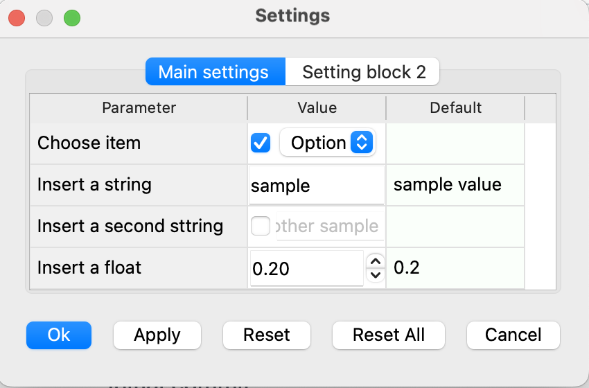

# SettingsManagerUI
A Python-based user interface for managing dynamic settings.

## Overview

SettingsManagerUI is a package designed to provide a simple and user-friendly interface for managing application settings stored in JSON format. It allows users to view, edit, and reset settings through a graphical interface built with PyQt.
It offers a straightforward and user-friendly way to manage settings stored in JSON format. SettingsManagerUI can use either PySide6 or qgis.PyQt, depending on the environment in which it is deployed. Using qgis.PyQt is particularly useful for developers creating QGIS plugins. 



# Integrating SettingsManagerUI within Another Package
To integrate SettingsManagerUI within another package, follow these steps:  
- Create a JSON Settings File with the appropriate structure.
- Initialize the SettingsTableDialog: Import and initialize the SettingsTableDialog class with the path to your JSON file and the block key.  
- Display the Dialog: Use the exec() method to display the settings dialog.
-  
Here is an example of how to use SettingsManagerUI within another package:


```python
# Import the SettingsTableDialog class
from setting_manager_ui.setting_ui import SettingsTableDialog

# Initialize the settings dialog with the path to the JSON file and the block key
dialog = SettingsTableDialog("path/to/config.json", block_key="block_key")

# Connect the Ok button signal to a method
dialog.accepted.connect(onOkClicked)

# Connect the Apply button signal to a method
dialog.applyClicked.connect(onApplyClicked)

# Display the settings dialog
dialog.exec()

```


## JSON Structure

The JSON file used by SettingsManagerUI should have the following structure:

```json
{
    "block_key1": {  // block 1
        "section1": {  // tab 1
            "parameter2": {
                "type": "string|int|float|dropdown|color", // currently five types are supported
                "value": "default_value",
                "default": "default_value", // if "auto" key is present, "default"=true|false is used as the default value  
                "auto": true|false,  // optional to enable a checkbox to enable automatic value
                "options": ["option1", "option2"]  // for dropdown type only
                "advanced": true|false,  // optional to hide the parameter in the basic view
            },
            "parameter2": {
                ...
            },
            ...
        },
        "section2": { // tab 2
            ...
        },
    },
    "block_key2": {  // block 2
        ...
    },
}
```


## License
This package is licensed under the GPL-3.0 license. See the LICENSE file for more details.

## Author
[Mahmud Haghighi](https://www.ipi.uni-hannover.de/en/haghighi/)

## Contact
For any questions or issues, please create an issue on the GitHub repository.

